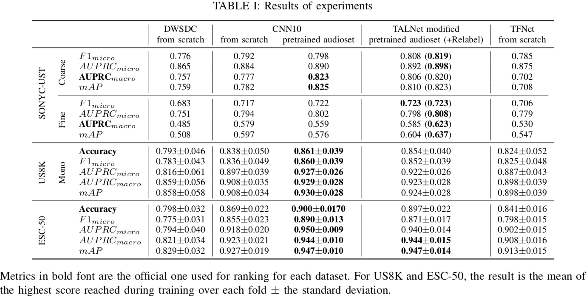

# Urban Sound Classification : striving forwards a fair comparison

This repo contains code for our paper: **Urban Sound Classification : striving forward a fair comparison**. We provide a fair comparison in sound classification by using the same input representation, same metrics and optimizer to assess performances. We preserve data augmentation used by original papers. We hope this framework could help evaluate new architectures in this field.

## Environement setup

Python version recquired : 3.6 (Higher might work).
We recommand first to create a new environment in conda/virtualenv then to activate it.

Pip install

~~~bash
pip install -r requirements.txt
~~~

Conda install

~~~bash
conda env create -f environment.yml
~~~

Manual install

~~~bash
pip install numpy scikit-learn pandas tqdm albumentations librosa tensorboard torch torchvision oyaml pytorch-lightning numba==0.49
pip install torchaudio -f https://download.pytorch.org/whl/torch_stable.html
~~~

## Editing `config.py`

You should edit PATH in `config.py` to match the directory in which everything will be stored.

## Data download and preprocessing

Use the following to download the dataset and precompute inputs.

WARNING : It requires about 30Go of free space.

~~~bash
python data_prep.py --download --mel
~~~

If you want to manualy download and decompress files, you have to put everything in the `audio` directory (`cf config.py`). Then you have to use the above command without the `--download`.

To use relabelling for TALNet modified, copy paste the `best2.csv` into the SONYC-UST folder.

## Results and how to reproduce experiments

The code should work on both CPU and GPU.
If you want to train everything on CPU, remove `gpus=1` in the corresponding model_*.py file. The scripts used for the comparison are the test_model_*.sh file. To run one test, just execute the following command :

~~~bash
sh test_model_MODELNAME.sh
~~~

## Cite

TODO
